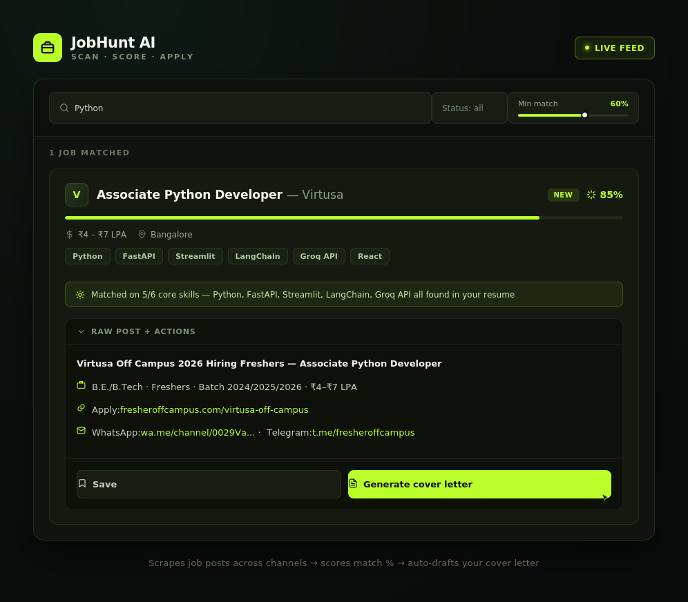
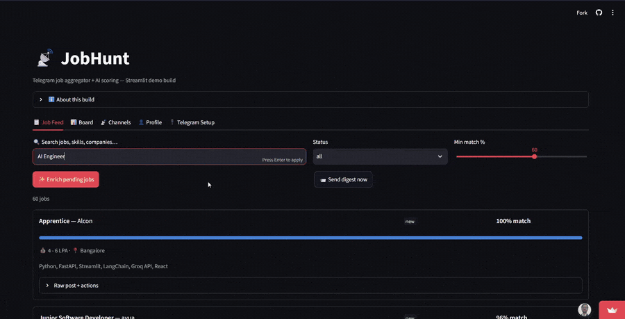

# JobHunt — Telegram Job Aggregator + Auto-Apply


**JobHunt watches your Telegram job channels, scores every post against your profile with AI, and applies for you with one click.**

439 jobs scraped from 5 channels in under 60 seconds — ranked, scored, ready to apply.

[🔗 Live Demo](https://jobhunt-ai.streamlit.app/) &nbsp;|&nbsp; [👤 LinkedIn](https://www.linkedin.com/in/ayush-s-tomar/) &nbsp;|&nbsp; [📹 Video](https://github.com/user-attachments/assets/a41dfeaf-7a10-44ae-b5ec-1953bde9045e)

---

## 📚 Contents

[The Problem](#the-problem) · [What It Does](#what-it-does) · [Demo](#demo) · [Architecture](#architecture) · [Tech Stack](#tech-stack) · [Security](#security) · [Run Locally](#run-locally) · [Multi-User](#multi-user) · [Roadmap](#roadmap) · [Troubleshooting](#troubleshooting)

---

## The Problem

Indian job seekers manually check 10+ Telegram job channels a day, copy-paste apply links, and retype the same cover letter with minor tweaks. Hours wasted. Good openings missed because nobody saw the post in time.

**JobHunt automates the whole pipeline — from Telegram post to submitted application.**

---

## What It Does

Connect your Telegram account. Add job channels. JobHunt scrapes every post, scores it against your profile with AI, and lets you apply in one click.

| Step | What happens |
|------|-------------|
| 📡 **Scrape** | Polls your Telegram channels every 15 minutes via MTProto |
| 🤖 **Enrich** | Groq AI extracts title, company, salary, skills, apply link |
| 🎯 **Score** | Matches job requirements against your skills and experience (0–100%) |
| ✉️ **Apply** | Sends a tailored email + resume, or fills the form via Playwright |

```
Telegram channel posts a job
         ↓
Scraper picks it up every 15 min
         ↓
Groq AI enriches: title, company, salary, match score
         ↓
Job appears in dashboard, ranked by match %
         ↓
You click "Confirm & Auto-Apply"   ← the only human step
         ↓
Bot sends email or fills the form → Status: Applied ✅
```

---

## Demo





Jobs are ranked by AI match score — the best fits float to the top. Each card shows salary, location, company, and a one-click apply button. Real listings from companies like Zoom, Kone, GreyOrange, and Zebra, pulled straight from Telegram.

<!-- TODO: screenshot of a sent application (email draft or filled-form confirmation) — shows the actual output, not just the dashboard leading up to it. Highest-impact addition here. -->

> **Note:** the hosted demo is a stripped-down single-user build — no auth, no background scraper, no live auto-apply — so it runs free on Streamlit Cloud. The full multi-user system in [Multi-User](#multi-user) below lives in `/backend` and requires self-hosting with Postgres.

---

## Architecture

FastAPI backend with a scheduled scraper running alongside the API process rather than as a separate worker — kept intentionally simple for a single free-tier deploy target. Each user's Telegram session (`StringSession`) is Fernet-encrypted and stored per-row in Postgres, so scraping resumes correctly after a redeploy instead of forcing a re-login.

```
Telethon scraper (MTProto) → Groq enrichment/scoring → PostgreSQL → FastAPI → dashboard
                                                              ↑
                                           per-user encrypted Telegram session
```

**Design trade-off:** auto-apply defaults to a human-confirm step before any email or form submission goes out. Deliberately not fully autonomous — a bad auto-send (wrong resume, wrong company) is worse than a missed job.

---

## Tech Stack

| Layer | Technology |
|-------|-----------|
| Backend | FastAPI + SQLAlchemy |
| Database | PostgreSQL (production) / SQLite (local) |
| Telegram | Telethon (MTProto) — per-user sessions stored encrypted in DB |
| AI | Groq API (`llama-3.3-70b-versatile`) |
| Form automation | Playwright (Chromium) |
| Auth | JWT (HttpOnly cookies) + bcrypt passwords + Fernet encryption |
| Deploy | Streamlit Community Cloud |
| Frontend | Vanilla JS + CSS (single HTML file, no build step) |

---

## Security

- Passwords → bcrypt hashed, never stored plain
- Telegram API keys → Fernet encrypted before hitting the DB
- Telegram sessions → `StringSession` stored encrypted in DB (survives redeploys)
- JWT tokens → HttpOnly cookies (XSS-proof), 30-day expiry
- All routes → `user_id` scoped, no cross-user data leaks
- Rate limiting → 5 login attempts/min, 3 registrations/hour per IP

---

## Project Structure

```
jobhunt/
├── backend/
│   ├── database.py          # SQLAlchemy models (User, Job, Channel, Application)
│   ├── auth.py              # JWT, bcrypt, Fernet encryption
│   ├── ai_scorer.py         # Groq: parse + score + cover letter
│   ├── telegram_auth.py     # Per-user Telegram OTP flow + session management
│   └── apply_bot.py         # Email sender + Playwright form-filler
├── scraper/
│   └── telegram_scraper.py  # MTProto scraper, per-user StringSession
├── frontend/
│   └── index.html           # Full dashboard UI
├── main.py                  # All FastAPI routes
├── run.py                   # Starts server + scraper scheduler
└── .env.example
```

---

## Run Locally

```bash
# 1. Clone
git clone https://github.com/ayush-s-tomar/jobhunt.git
cd jobhunt

# 2. Create virtual environment
py -3.11 -m venv venv
venv\Scripts\activate
pip install -r requirements.txt
playwright install chromium

# 3. Generate secret keys
python -c "import secrets; print(secrets.token_hex(32))"          # → SECRET_KEY
python -c "from cryptography.fernet import Fernet; print(Fernet.generate_key().decode())"  # → FERNET_KEY

# 4. Set up .env
copy .env.example .env
# Fill in SECRET_KEY, FERNET_KEY, GROQ_API_KEY

# 5. Start
python run.py
# → http://localhost:8000
```

**Free API keys needed:**
- Groq → https://console.groq.com/keys *(free tier: 14,400 req/day)*
- Telegram → https://my.telegram.org → API development tools

---

## Multi-User

The self-hosted backend (`/backend`) is built multi-user from the ground up — this is not enabled in the free Streamlit demo above. Each user:

- Logs in with their own account
- Connects their own Telegram (API keys + OTP)
- Gets their own job feed, channels, and profile
- Has a session stored encrypted in the DB — survives server redeploys

Deploy `/backend` with Postgres and share the link — everyone gets their own isolated dashboard.

---

## Roadmap

- [ ] **Email notifications** when a high-match job (>80%) is scraped
- [ ] **Resume parser** to auto-fill skills from an uploaded PDF
- [ ] **Private channel support** via invite link
- [ ] **Weekly digest** — top 10 matches emailed every Monday
- [ ] **Mobile app** — React Native wrapper around the same API

---

## Troubleshooting

| Problem | Fix |
|---------|-----|
| `No session for user` | Go to Telegram Setup → reconnect |
| `0 jobs after scrape` | Join the channels in the Telegram app first, then scrape |
| Enrich shows 0% | Fill your profile with skills first, then click Enrich |
| Site takes a while to load | Streamlit free tier sleeps after inactivity — first load wakes it up |
| `pydantic-core` build error | Pin `PYTHON_VERSION=3.11.9` in your environment |

---

## Author

**Ayush Singh Tomar** — AI/ML Developer
[GitHub](https://github.com/ayush-s-tomar) · [LinkedIn](https://www.linkedin.com/in/ayush-s-tomar/)

---

## License

Released under the [MIT License](LICENSE).

---

*Part of my AI developer portfolio. See also: [SalesAgent](https://github.com/ayush-s-tomar/salesagent) — autonomous B2B sales AI with LangGraph.*
